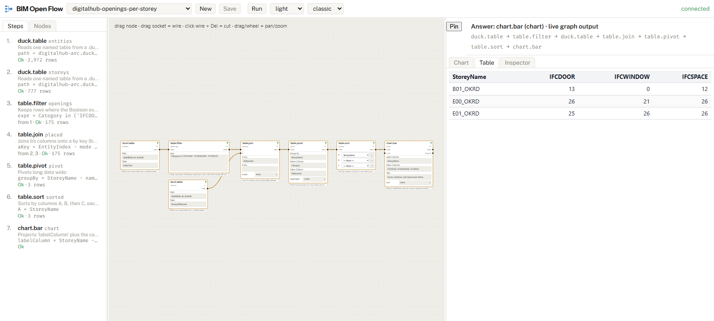
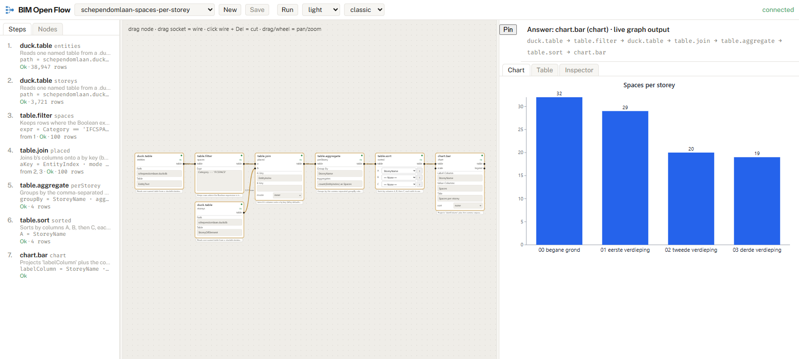

# BIM Open Flow


**A question about a building becomes a small graph you can see, run again, and hand to someone else.**

BIM Open Flow is a dataflow engine, a web editor, and an MCP (Model Context Protocol) server for answering questions about tables with graphs of a handful of nodes. A person draws the graph in the editor, or an AI agent builds it through the MCP server; either way the result is the same JSON document, evaluated by the same engine, shown in the same canvas. The building-specific parts (IFC and BOS loaders, the 3D pane, the rule checks for doors and rooms) live in [BIM Open Toolkit](https://github.com/ara3d/bim-open-toolkit); this repository holds everything that does not need to know what a wall is.

**Try it:** <https://ara3d.github.io/bim-open-flow/> opens six graphs over two real buildings in the live editor, with nothing to install. Pan the canvas, select a node to see the table it produces, hover a port to peek at the wire.

[](https://ara3d.github.io/bim-open-flow/)

## The premise

Answering a question about a building model, "how many spaces per storey?", "which doors are narrower than 850 mm?", usually means a query typed into a database shell, or a script against an authoring tool's API. The answer is a number in a chat window or a screenshot. Nobody can see how it was produced, rerun it next month on a new export, or hand it to a colleague who does not have the tool.

BIM Open Flow stores the computation instead of the answer. The question becomes a graph: a source node that reads a table, a few nodes that filter, join, group, and sort, and a node that draws a chart or writes a file. The graph is a JSON document of a few dozen lines. It can be drawn by a person, built by an agent, evaluated for display without side effects, and replayed later from a run record that pins every input by content hash.

Three rules follow from that, and they shape everything else here:

- **One edit path.** Every change to a graph is one of four operations: `addNode`, `connect`, `setParam`, `removeNode`. A mouse gesture, an HTTP call, and an MCP tool all go through them, so a graph an agent builds is one a person could have drawn, and the editor can show the agent's work as it happens.
- **Nothing writes until Run.** Evaluating a graph for display never touches a file. A node that writes a CSV, a report, or property sets back into an IFC stays `EffectPending` until an explicit Run. A person or an agent exploring a model cannot do harm by looking.
- **Runs are the evidence.** A run record stores the graph's hash and the content hash of every input beside the outputs, and replays. A number reported from a run can be traced to the bytes that produced it.

## What you see

**The editor.** A canvas of node cards wired together, each card carrying its parameters as controls. Every node shows its state: `Ok`, `Unready` when an input is missing, `EffectPending`, `Unavailable` when something upstream failed, or `Error` with the message. Selecting a node shows its output as a table or a chart in the pane beside the canvas; hovering a port shows the rows on that wire. A half-wired graph is a normal thing to look at and repair.



**The catalog.** Each node kind declares its ports, its parameter kinds, its enum values, and whether it is pure or an effect. The node reference, the editor's palette, and the description an agent reads are all generated from that one declaration, so there is no second place for the documentation to drift.


**The agent.** The MCP server exposes the same four operations as tools, plus evaluation and the catalog. An agent in Claude Code lists the databases, adds nodes, connects them, sets a parameter, evaluates, and reads the result table, and the person watching the editor sees the graph grow. The toolkit's Ask box is this loop with a text field in front of it.

## What a graph looks like

This graph, `samples/buildings/schependomlaan-room-names.json`, counts the rooms in a Dutch apartment block by name. It reads one DuckDB table, keeps the rows whose category is `IFCSPACE`, groups them by name, sorts, and draws a bar chart. The `layout` section, which only places the nodes on the canvas, is left out here.

```json
{
  "formatVersion": "0.1.0",
  "structure": {
    "nodes": [
      { "id": "entities", "kind": "duck.table", "version": 1 },
      { "id": "spaces", "kind": "table.filter", "version": 1 },
      { "id": "byName", "kind": "table.aggregate", "version": 1 },
      { "id": "sorted", "kind": "table.sort", "version": 1 },
      { "id": "chart", "kind": "chart.bar", "version": 1 }
    ],
    "edges": [
      { "from": "entities.table", "to": "spaces.table" },
      { "from": "spaces.table", "to": "byName.table" },
      { "from": "byName.table", "to": "sorted.table" },
      { "from": "sorted.table", "to": "chart.table" }
    ]
  },
  "values": {
    "entities": { "path": "{PUBLIC}/schependomlaan.duckdb", "table": "EntityText" },
    "spaces": { "expr": "Category == 'IFCSPACE'" },
    "byName": { "aggregates": "count(EntityIndex) as Spaces", "groupBy": "Name" },
    "sorted": { "A": "Spaces", "B": "Name", "descendingA": "true" },
    "chart": { "labelColumn": "Name", "title": "Spaces by name", "valueColumns": "Spaces" }
  }
}
```

Evaluated over the sample data, the `sorted` node outputs 15 rows for 100 spaces. The two most common names are `entree` and `instal. ruimte`, 11 each; `badkamer`, `keuken`, `mk`, `toilet`, and `woonkamer` have 10 each, one per apartment.

An agent builds the same graph by calling the MCP server's tools in order: `addNode` five times, `connect` four times, `setParam` for each value, then `evaluate` and `getResult`.

## The sample graphs

`samples/buildings` holds six graphs over two openly licensed buildings from [BIM Open Data](https://github.com/ara3d/bim-open-data): Schependomlaan, a ten-apartment block exported from Archicad, and DigitalHub, an office building of RWTH Aachen University exported from Revit in four discipline models. Each graph answers one question with generic table nodes only, and `samples/buildings/README.md` lists the numbers it produces. These are the graphs on the page.

| Graph | Question | Nodes |
|---|---|---|
| `schependomlaan-elements-by-category` | How many elements of each IFC class sit on a storey? | `duck.table`, `table.join`, `table.aggregate`, `chart.bar` |
| `schependomlaan-spaces-per-storey` | How many spaces on each storey? | `duck.table`, `table.filter`, `table.join`, `table.aggregate`, `table.sort`, `chart.bar` |
| `schependomlaan-room-names` | Which room names recur, and how often? | `duck.table`, `table.filter`, `table.aggregate`, `table.sort`, `chart.bar` |
| `digitalhub-openings-per-storey` | Doors, windows, and spaces per storey, side by side? | `duck.table`, `table.filter`, `table.join`, `table.pivot`, `table.sort`, `chart.bar` |
| `digitalhub-heating-per-storey` | Pipe segments, fittings, heaters, and valves per storey? | `duck.query`, `chart.bar` |
| `digitalhub-federated-models` | How many elements does each discipline model contribute? | `duck.query`, `chart.bar` |



`samples/analyses` holds six more graphs over small CSV, Excel, SQLite, and DuckDB files, which the host seeds into an empty store so the editor opens with something to look at.

## How to use it

### Prerequisites

- Windows. The host carries the native web-ifc library through the IFC loader, so the .NET solution builds on Windows only; the web editor and the page are portable.
- The .NET 8 SDK.
- Node.js 22, for the dependency script, the web editor, and the gates.
- Git, which the dependency script calls.

### Build and test

The repository reads its three dependencies from a git-ignored `deps/` folder, which `node deps.mjs` fills from the commits pinned in `deps.json`.

```
node deps.mjs
dotnet build BimOpenFlow.sln -c Release
dotnet test BimOpenFlow.sln -c Release --no-build --filter "TestCategory!=RequiresTestData"
npm ci --prefix bimopenflow/web
node gates/host-smoke.mjs
node gates/web-smoke.mjs
```

`host-smoke` starts the real host, drives its HTTP API through a graph end to end, and prints `HOST SMOKE: PASS`. `web-smoke` tests and type-checks every web package and builds the editor. CI (`.github/workflows/build.yml`) runs the same steps on every push.

### Run the editor

```
npm run host --prefix bimopenflow/web
npm run web --prefix bimopenflow/web
```

The first command starts the host on port 5214 with the `tables` profile and seeds its store with the graphs in `samples/analyses`. The second serves the editor on port 5304 against it. To open the building graphs, replace `{PUBLIC}` in a `samples/buildings` document with the absolute path of `deps/bim-open-data/samples/public` and save it into the store, or load it through the editor.

### Register the MCP server with an agent

The MCP server speaks stdio by default, which is how MCP clients launch a server, or HTTP with `--http <port>`. After the Release build, this `.mcp.json` entry registers it with Claude Code, pointed at the public buildings:

```json
{
  "mcpServers": {
    "bimopenflow": {
      "command": "dotnet",
      "args": [
        "src/mcp/BimOpenMcp.Flow/bin/Release/net8.0-windows/bimopenmcp-flow.dll",
        "--models", "deps/bim-open-data/samples/public",
        "--store", "artifacts/flow/store",
        "--cache", "artifacts/flow/cache"
      ]
    }
  }
}
```

The server's tools fall into five groups: models and databases (`listModels`, `listDatabases`, `describeDatabase`), documents (`listAnalyses`, `getAnalysis`, `saveAnalysis`), edits (`addNode`, `connect`, `setParam`, `removeNode`, and `editGraph` for a batch), evaluation (`evaluate`, `getResult`, `createRun`, `listRuns`, `getNodeCatalog`), and the repository's own documentation (`readDoc`, `searchDocs`). The toolkit's `.claude/skills/bim-flow/` holds the guide an agent reads before its first call.

## How it works

**A graph** is a JSON document of nodes and the wires between them. Each node is a small function with typed input and output ports and parameters set on the node itself. Six kinds of value travel on wires: Boolean, Integer, Number, Text, Table, and Relation. Almost everything useful is an immutable Table. A Relation is a query plan with its schema, not rows; the rows exist only once a node executes the plan. A new kind of input is a new parameter kind, never a new wire type, so one vocabulary serves loading, SQL, table operations, charts, and checks.

**Pure nodes and effects.** A pure node only computes; its results are memoized and recomputed when an input changes. An effect node writes something: a CSV, Excel, or Parquet file, a report, or property sets back into an IFC file. Every effect node lives in one pack, `BimOpenFlow.Nodes.Effects`, so purity is enforced by project reference rather than by annotation. The publishing projects turn a run into a self-contained HTML report, a dashboard, or an evidence package: a zip whose `manifest.json` lists a SHA-256 per member.

**Profiles.** A host serves a named set of node packs and the sample data that goes with them. This repository's host offers the `tables` profile, 83 node kinds for loading, cleaning, joining, grouping, dating, charting, and writing tables. The toolkit composes a `bim` profile on top of it with the building packs.

**The web client** is eight npm workspaces: `contracts` (the wire types, generated from the C# ones), `api-client`, `state`, `graph` (the canvas, built on [Gratify](https://github.com/ara3d/gratify)), `viz` (tables and charts), `client`, `panes`, and `app`. The page at `site/` runs the same `app` over a static copy of the sample results, which is why it needs no server.

## Trade-offs

- **One edit path, so no scripting shortcut.** Routing every edit through four operations keeps the editor, the HTTP API, and the agent in step. The cost is that building a large graph is many small calls, and there is no loop or conditional inside a graph.
- **Tables as the currency.** Treating a scalar as a parameter rather than a value on a wire keeps the node vocabulary small. The cost is that a count computed by one node reaches another as a one-row table, not as a number.
- **Effects isolated by project reference.** Purity is checked by the compiler and a layering test, which is hard to get wrong. The cost is that a node that both reads and writes has to be split in two.
- **Dependencies by pinned commit, not packages.** `deps.json` pins three sibling repositories by commit and the build reads their source. A change in the engine lands here the day it is made. The cost is a `node deps.mjs` before every build and a second checkout of each dependency on disk.
- **C# nodes only.** A node is a class with declared ports, so the catalog, the editor, and the agent's tool description are generated from one declaration. The cost is a host build for every new node; a script-defined node is an open question in the toolkit (its ticket TKT-162).

## What it does not do

- It has no node that knows about buildings. The packs that turn an IFC or BOS (BIM Open Schema) file into tables, and the 3D pane, belong to the toolkit. This repository reads building files only through [BIM Open Data](https://github.com/ara3d/bim-open-data), as DuckDB databases of tables.
- It does not draw 3D geometry. [BIM Open Viewer](https://github.com/ara3d/bim-open-viewer) does.
- It is not a hosted service. The host is a single-user local process with no accounts and no authentication.
- It does not evaluate in the browser. The page shows results the tests computed; changing a graph and rerunning it needs the host.
- It does not run on Linux or macOS.

## Related work

The category is not new. These are the closest tools, with how this one differs; comparisons like these go stale.

- **[Dynamo](https://dynamobim.org/) and [Grasshopper](https://www.grasshopper3d.com/)** are visual programming environments inside Revit and Rhino. They are mature, have thousands of nodes, and are the tools most BIM professionals already know. They run inside an authoring tool and operate on its live model; BIM Open Flow runs outside any authoring tool over an exported file, and is meant to be driven by an agent as much as by a person.
- **[IfcSverchok](https://github.com/IfcOpenShell/IfcOpenShell)**, part of IfcOpenShell, is a node add-on for Blender that creates and reads IFC through Sverchok nodes. It is geometry-first and lives in Blender; this project is table-first and has no geometry nodes.
- **[Speckle Automate](https://speckle.systems/use-cases/automate)** runs functions over Speckle's hosted model data on change, schedule, or request, with prebuilt checks. It is a hosted service with accounts and connectors to many authoring tools; this project is a local process over a file.
- **[KNIME](https://www.knime.com/)**, [Node-RED](https://nodered.org/), and similar general dataflow tools cover table workflows well, and KNIME has published an MCP server pattern. They know nothing about BIM and carry a much larger runtime; this project is a small engine whose node packs are written for a building toolkit, with runs that pin their inputs by hash.
- **A SQL shell over the DuckDB export** is the baseline the toolkit measures against. It is faster to start and needs no editor, but leaves no replayable record and no picture of the computation.

What this repository claims as its own is narrow: one edit path shared by the editor and the MCP server, effects that cannot run outside an explicit Run, and run records that replay from content hashes.

## How the repository is organized

| Path | Contents |
|---|---|
| `src/flow/BimOpenFlow.Contracts`, `contracts/` | Wire types shared with the web client, and the generator of their TypeScript twins |
| `src/flow/BimOpenFlow.Nodes.*` | One project per vocabulary: tables, table operations, cleaning, dates, DuckDB, relations, spatial, compliance checks, charts, effects. `Nodes.Support` holds shared helpers |
| `src/flow/BimOpenFlow.Relations`, `.Relations.DuckDb` | Query plans and schemas behind the `rel.*` nodes, and their DuckDB compiler |
| `src/flow/BimOpenFlow.Host*` | Model discovery (`Host.Catalog`), graphs and runs on disk (`Host.Store`), the four operations over HTTP (`Host.Api`), and the composition root (`Host`), which serves the `tables` profile as `bimopenflow-host` |
| `src/flow/BimOpenFlow.Publishing`, `.Reports`, `.Dashboards`, `.Evidence` | What a run produces for people |
| `src/flow/BimOpenFlow.GraphText`, `.NodeDocs` | A graph as readable text, and the node reference generated from the catalog |
| `src/mcp/BimOpenMcp.Flow` | The MCP server, `bimopenmcp-flow` |
| `src/studio/BimOpenFlow.Ask` | The agent loop behind the toolkit's Ask box, over any in-process MCP server, with Anthropic, OpenAI, and Claude Code command-line backends |
| `bimopenflow/web/packages/` | The editor as eight npm workspaces |
| `samples/tables`, `samples/analyses`, `samples/relations` | Small CSV, Excel, SQLite, DuckDB, JSON, and BFAST tables, and the graphs over them that the tests evaluate |
| `samples/buildings` | Six graphs over two public buildings, with the numbers they produce |
| `site/` | The page, deployed to GitHub Pages by `.github/workflows/pages.yml`; `site/README.md` says how it is built |
| `tests/`, `gates/` | NUnit projects per library, a layering test, and the smoke gates |
| `deps.json`, `deps.mjs` | The pinned dependencies and the script that fetches them |

The dependencies are [`ara3d-dataflow`](https://github.com/ara3d/ara3d-dataflow), the engine (specification, evaluator, expression language, run records, and conformance suite); [`bim-open-data`](https://github.com/ara3d/bim-open-data), the BIM Open Schema libraries and the IFC loader; and [`gratify`](https://github.com/ara3d/gratify), the canvas library. When this repository is itself a dependency, as the toolkit's `deps/bim-open-flow`, `deps.mjs` links its `deps/*` to the host repository's copies so each one is checked out and built once.

The tests cover the engine's node packs over the sample tables, the six building graphs with their numbers, the MCP server's tools, the Ask loop over a scripted chat backend, the graph-to-text rendering, and the web packages under vitest. The host smoke gate exercises the HTTP API end to end; the editor's canvas is tested under jsdom, not in a real browser.

## Who it is for

- A developer building a tool over building data who wants a graph engine, an editor, and an MCP server that already agree with each other.
- A developer adding a node pack, a pane, or an MCP tool to the BIM Open family.
- An agent author who wants a tool surface where exploration cannot write files.

A BIM professional with a model and a question should start with the [toolkit](https://github.com/ara3d/bim-open-toolkit), which adds the building nodes, the studio with its Ask box, and the 3D pane.

## The family

BIM Open Flow is one of the BIM Open repositories, with [BIM Open Data](https://github.com/ara3d/bim-open-data) (the .NET implementation of BIM Open Schema and IFC), [BIM Open Viewer](https://github.com/ara3d/bim-open-viewer), [BIM Open Notebook](https://github.com/ara3d/bim-open-notebook) (agent sessions as documents), and [BIM Open Toolkit](https://github.com/ara3d/bim-open-toolkit), which joins them. The mark and colours follow the toolkit's `docs/BRANDING.md`.

## License and help

MIT; see `LICENSE`. The sample buildings keep their own licences, listed in `samples/buildings/README.md`. Report problems as issues on this repository.
